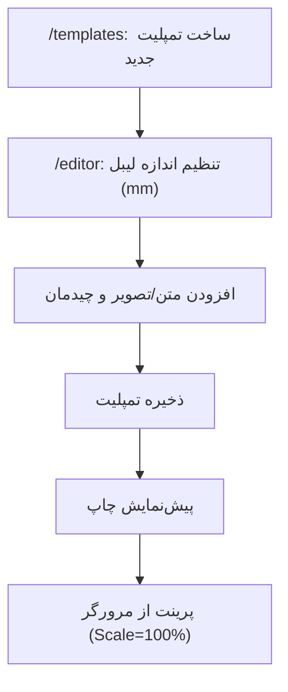

## 1. نمای کلی محصول
یک ادیتور تحت وب برای طراحی لیبل با ابعاد دلخواه بر اساس میلی‌متر، با قابلیت اضافه‌کردن متن و تصویر، جابه‌جایی Drag & Drop، ذخیره و مدیریت تمپلیت‌ها، و خروجی/چاپ سازگار با اکثر پرینترها از طریق دیالوگ پرینت سیستم.
- مسئله اصلی: ساخت لیبل دقیق با اندازه واقعی (میلی‌متر) بدون وابستگی به نرم‌افزارهای اختصاصی هر برند
- کاربران هدف: فروشگاه‌ها، انبارداری، تولیدکنندگان، کاربران خانگی که لیبل‌های کوچک/رولی چاپ می‌کنند
- ارزش: یکسان‌سازی فرآیند طراحی و خروجی گرفتن برای سایزهای مختلف و پرینترهای متنوع

## 2. قابلیت‌های اصلی

### 2.1 نقش‌های کاربری
این نسخه تک‌کاربره (روی مرورگر) طراحی می‌شود و نقش‌بندی ندارد.

### 2.2 ماژول‌های قابلیت (حداقلِ لازم)
1. **کتابخانه تمپلیت‌ها**: ساخت/ویرایش/کپی/حذف، جستجو، برچسب‌گذاری (Tag)، خروجی/ورودی (Export/Import)
2. **صفحه ادیتور لیبل**: تعیین اندازه لیبل بر حسب میلی‌متر، افزودن متن/تصویر، انتخاب و تغییر استایل‌ها، جابه‌جایی و تغییر اندازه عناصر، پیش‌نمایش چاپ
3. **خروجی و چاپ**: خروجی PNG/PDF (در صورت نیاز)، چاپ از طریق مرورگر با کنترل مقیاس و بدون Stretch

### 2.3 جزئیات صفحات
| نام صفحه | ماژول | توضیح قابلیت |
|---|---|---|
| /templates | لیست تمپلیت‌ها | نمایش کارت‌ها، جستجو، ساخت تمپلیت جدید، دکمه Import/Export، نمایش سایز هر تمپلیت (mm) |
| /editor | تنظیمات لیبل | عرض/ارتفاع (mm)، واحد، DPI/Scale (پیش‌فرض 203dpi برای لیبل‌پرینترها)، جهت (portrait/landscape)، حاشیه امن |
| /editor | بوم طراحی (Label Canvas) | نمایش فریم لیبل با خط‌کش (ruler)، شبکه (grid) اختیاری، Snap به گرید، نمایش مختصات/اندازه عنصر انتخاب‌شده |
| /editor | عناصر (Objects) | افزودن Text Box و Image، انتخاب/حذف/کپی/لایه‌بندی (Bring to front/back)، Drag & Drop و Resize و Rotate |
| /editor | ویرایش متن | ویرایش مشابه ورد در سطح Text Box: فونت، اندازه، بولد/ایتالیک/زیرخط، رنگ، تراز، فاصله خطوط؛ ذخیره محتوا به صورت HTML/JSON |
| /editor | مدیریت تصاویر | آپلود از سیستم، تغییر اندازه، برش ساده (اختیاری)، فیت/فیل، قفل نسبت ابعاد |
| /editor | ذخیره تمپلیت | ذخیره خودکار (Auto-save) و ذخیره دستی، نام‌گذاری، ایجاد نسخه جدید (Duplicate/Save as) |
| /editor | خروجی/چاپ | پیش‌نمایش چاپ، انتخاب Scale 100%، راهنمای تنظیمات پرینت (بدون حاشیه/بدون Fit to page) |

## 3. فرآیندهای اصلی (Core Process)
### 3.1 جریان ساخت تمپلیت جدید
1) کاربر از صفحه تمپلیت‌ها «تمپلیت جدید» را انتخاب می‌کند  
2) ابعاد لیبل را بر اساس میلی‌متر وارد می‌کند  
3) وارد ادیتور می‌شود، متن و تصویر اضافه می‌کند و چیدمان را با Drag & Drop انجام می‌دهد  
4) تمپلیت را ذخیره می‌کند  
5) خروجی می‌گیرد یا چاپ می‌کند

### 3.2 نکته کلیدی سازگاری با پرینترها
- هدف این محصول «خروجی استاندارد با اندازه واقعی» است تا کاربر بتواند با پرینترهای مختلف از طریق سیستم‌عامل/مرورگر چاپ کند.
- چاپ مستقیم به سخت‌افزارهای خاص (مثلاً Bluetooth-only مثل Phomemo M220) معمولاً نیازمند اپ/درایور اختصاصی یا سرویس واسط است و در هسته نسخه اول قرار نمی‌گیرد.

## 4. طراحی رابط کاربری

### 4.1 سبک طراحی
- رویکرد: Desktop-first (قابل استفاده روی موبایل برای مشاهده/ویرایش محدود)
- رنگ‌ها: پس‌زمینه خنثی روشن + رنگ اکسن برای وضعیت انتخاب (Selection) و ابزارهای مهم
- تایپوگرافی: فونت خوانا برای UI + فونت‌های متنوع برای محتوا (مطابق فونت‌های نصب‌شده کاربر)
- Layout: نوار ابزار بالا (Top toolbar) + پنل ویژگی‌ها سمت راست + بوم در مرکز + لیست لایه‌ها اختیاری
- آیکن‌ها: سبک خطی (outline) با حالت فعال/غیرفعال واضح

### 4.2 نمای کلی طراحی صفحات
| نام صفحه | ماژول | عناصر UI |
|---|---|---|
| /templates | کارت تمپلیت | نام، سایز (W×H mm)، آخرین ویرایش، دکمه‌های Edit/Duplicate/Delete |
| /templates | Import/Export | Import JSON، Export JSON برای انتقال بین دستگاه‌ها |
| /editor | Toolbar | افزودن متن/تصویر، Undo/Redo، Align، Bring to front/back، Zoom |
| /editor | Properties Panel | ابعاد/موقعیت (mm)، چرخش، استایل متن، قفل/مخفی کردن، تنظیمات تصویر |
| /editor | Canvas | نمایش فریم لیبل، گرید/اسنپ، خط‌کش (اختیاری)، هندل‌های Resize/Rotate |
| /editor | Print/Export Modal | پیش‌نمایش، انتخاب مقیاس، دانلود PNG/PDF، راهنمای تنظیمات پرینت |

### 4.3 واکنش‌گرایی
- دسکتاپ: تجربه کامل
- تبلت: پنل‌ها به حالت کشویی (drawer) تبدیل شوند
- موبایل: تمرکز روی مشاهده و ویرایش سبک (Drag ساده) + محدود کردن برخی ابزارهای پیشرفته

## 5. موارد خارج از محدوده نسخه اول (برای شفافیت)
- اتصال مستقیم و ارسال فرمان چاپ به Bluetooth/USB برای برندهای خاص بدون درایور (نیازمند راه‌حل‌های اختصاصی)
- مدیریت کاربران/چندکاربره و ذخیره ابری (قابل افزودن در نسخه‌های بعدی)
- بارکد/QR پیشرفته (می‌تواند به عنوان افزونه/فاز بعدی اضافه شود)

