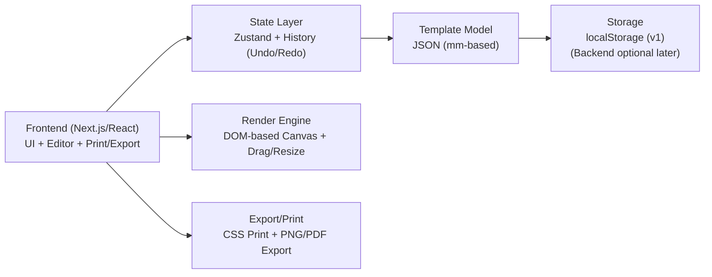

## 1. طراحی معماری



## 2. توضیحات تکنولوژی
- Frontend: Next.js (React + TypeScript)
- Styling: Tailwind CSS
- State: Zustand (برای انتخاب آیتم، لیست عناصر، زوم/اسکیل، تاریخچه تغییرات)
- Drag/Resize: react-rnd یا dnd-kit (انتخاب نهایی در فاز پیاده‌سازی)
- Rich Text داخل Text Box: TipTap (ProseMirror) برای تجربه نزدیک به Word داخل هر Text Box
- Export تصویر: html-to-image (خروجی PNG با اندازه دقیق)
- Export PDF (اختیاری): jsPDF یا راهکار مبتنی بر print-to-pdf مرورگر
- Storage: localStorage برای نسخه اول + Import/Export JSON

## 3. تعریف مسیرها (Routes)
| Route | هدف |
|---|---|
| /templates | مدیریت تمپلیت‌ها (ساخت/ویرایش/حذف/جستجو/Import/Export) |
| /editor | ادیتور لیبل (بوم طراحی، ابزارها، پنل ویژگی‌ها، چاپ/خروجی) |

## 4. مدل داده (Template Model)
### 4.1 اصول مدل‌سازی
- تمام اندازه‌ها و مختصات در مدل، بر حسب میلی‌متر ذخیره می‌شوند (برای مستقل بودن از DPI)
- در UI، میلی‌متر به پیکسل تبدیل می‌شود: `px = (mm / 25.4) * dpi`
- DPI پیش‌فرض: 203 (رایج در لیبل‌پرینترهای حرارتی)، قابل تغییر توسط کاربر

### 4.2 ساختار پیشنهادی JSON
```json
{
  "id": "tpl_123",
  "name": "Shipping Label 50x30",
  "label": {
    "widthMm": 50,
    "heightMm": 30,
    "dpi": 203,
    "safeMarginMm": 1
  },
  "elements": [
    {
      "id": "el_text_1",
      "type": "text",
      "xMm": 5,
      "yMm": 4,
      "wMm": 40,
      "hMm": 10,
      "rotateDeg": 0,
      "locked": false,
      "data": {
        "html": "<p><strong>Hello</strong> world</p>",
        "defaultFontFamily": "Arial",
        "defaultFontSizePx": 14,
        "color": "#111111",
        "align": "left"
      }
    },
    {
      "id": "el_img_1",
      "type": "image",
      "xMm": 5,
      "yMm": 16,
      "wMm": 20,
      "hMm": 12,
      "rotateDeg": 0,
      "locked": false,
      "data": {
        "src": "data:image/png;base64,...",
        "fit": "contain"
      }
    }
  ],
  "meta": {
    "createdAt": "2026-07-19T00:00:00.000Z",
    "updatedAt": "2026-07-19T00:00:00.000Z",
    "version": 1
  }
}
```

## 5. معماری ادیتور (جزئیات)
### 5.1 اجزای کلیدی UI
- TemplateLibrary: CRUD تمپلیت‌ها + Import/Export
- EditorShell: Layout کلی (Toolbar + Canvas + Properties)
- LabelCanvas: کانتینر اصلی با ابعاد پیکسلی محاسبه‌شده از میلی‌متر
- ElementRenderer: رندر عنصرهای text/image و هندل‌های انتخاب/Resize/Rotate
- PropertiesPanel: ویرایش دقیق x/y/w/h بر حسب میلی‌متر + تنظیمات تایپوگرافی/تصویر
- History: Undo/Redo با Snapshot یا Command pattern (مبتنی بر Zustand)

### 5.2 چاپ و خروجی
- Print Mode: یک مسیر/کامپوننت مخصوص پرینت که فقط محتوای لیبل را با `@media print` نمایش دهد
- جلوگیری از تغییر مقیاس: تأکید روی چاپ با Scale=100% و غیرفعال کردن Fit-to-page (در UI راهنما ارائه شود)
- Export PNG: رندر DOM به تصویر با ابعاد دقیق، سپس دانلود
- Export PDF: در صورت نیاز، تبدیل PNG به PDF با ابعاد فیزیکی صحیح

## 6. تصمیمات امنیتی/حریم خصوصی
- تمام داده‌ها در نسخه اول روی دستگاه کاربر ذخیره می‌شود (localStorage)
- هیچ کلید/اطلاعات حساس در کلاینت ذخیره یا لاگ نمی‌شود

## 7. توسعه‌های آینده (اختیاری)
- Backend اختیاری برای ذخیره ابری تمپلیت‌ها (مثلاً Supabase)
- پشتیبانی افزونه‌ای از Printer Profiles (تنظیمات آماده برای سایزهای رایج)
- بارکد/QR و متغیرهای داده (Data binding) برای چاپ سریالی

